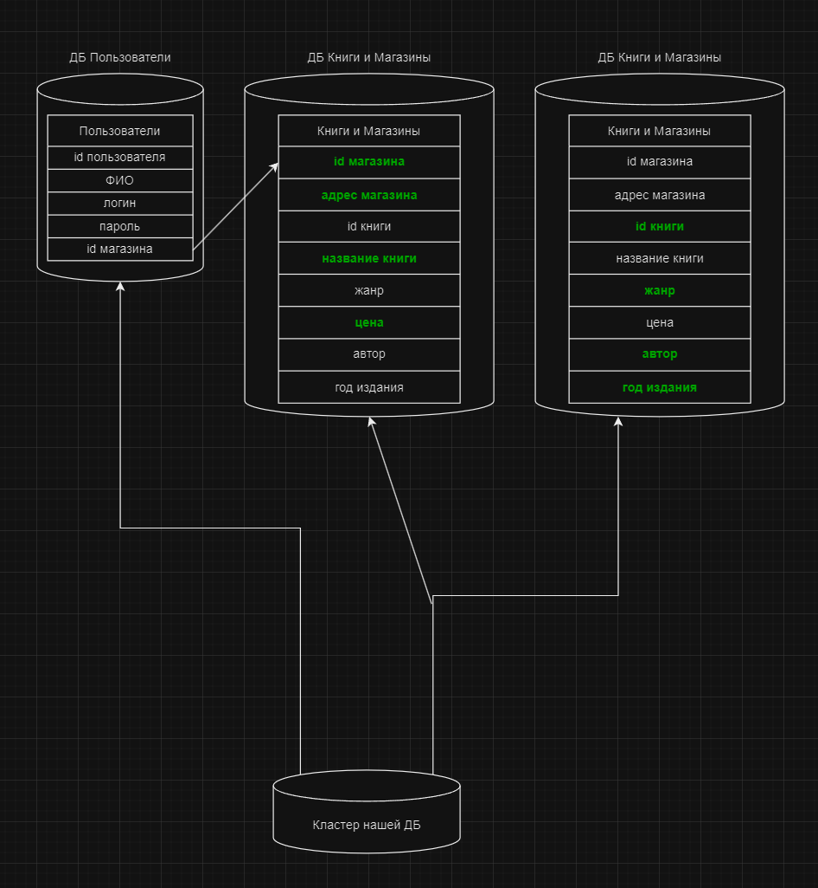

# "Replication-and-scaling.-Part-2" | "Бойко Владислав"
---
## Задание 1
1. активный master-сервер и пассивный репликационный slave-сервер. Как и обсуждалось на предидущем занятии в даном виде масштабирования основное преемущество это снятие нагрузки на мастер сервер поскольку чтение будит происходить с слейва. 
2. master-сервер и несколько slave-серверов. Тут то же самое с увеличением колличества слейвов будит рости скорость чтения, но есть и еще коечто. Если слейвов будит несколько и они будут раскиданны по разным физическим HDD/SSD то можно говорит о некой надежности нашей базы. + это довольно просто натроить. Так же можно настроить master-masler, но таким как известно на трезвую голову только в учебных целях занимаются.
3. активный сервер со специальным механизмом репликации — distributed replicated block device (DRBD). Увеличение надежности, на случай выхода из строя основного сервера, полная реплика с данными останится на secondary сервере.
4. SAN-кластер. Если в кратце, то увиличиваем отказоустойчивость кластера, и по сути продолжение работы в случае отказа какого либо ресурса(читал в гугле, вот как понял так и написал, исправле если не ошибся.)
---
## Задание 2
Ну попробуем. Допустим будим исходить из того что это некая ДБ онлайн магазина книг. Из этого делаем вывод, что необходимо вертикально вынести отдельно пользователей и отдельно книги и магазины в свою очередь книги и магазины расшардить горизонтально, посколько сайт наиболее часто просматривают неавторизированные пользователи. Таким образом мы получаем отдельныуб базу под пользователей и ускоряем мем самы авторизацию. И отдельную базу под магазины и их ассортимент. 
Связь между пользователями и книги/магазины через id магазина.
Диорамму вложил.
