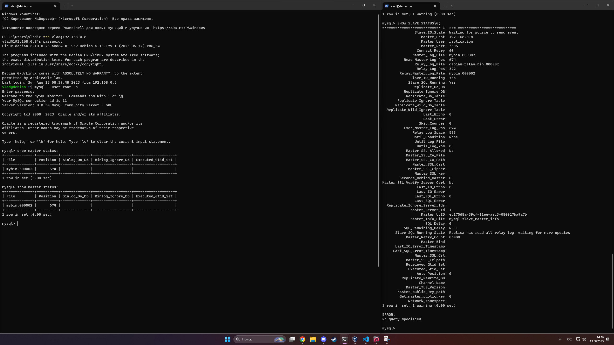
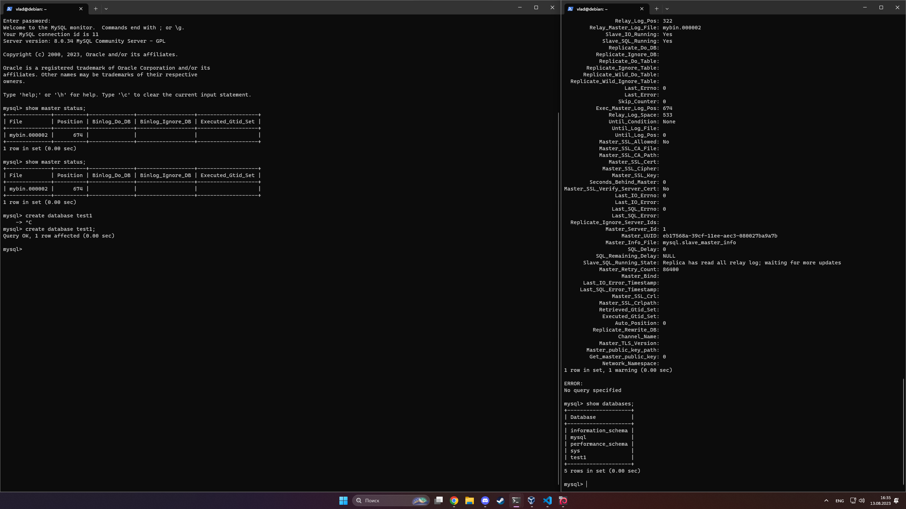
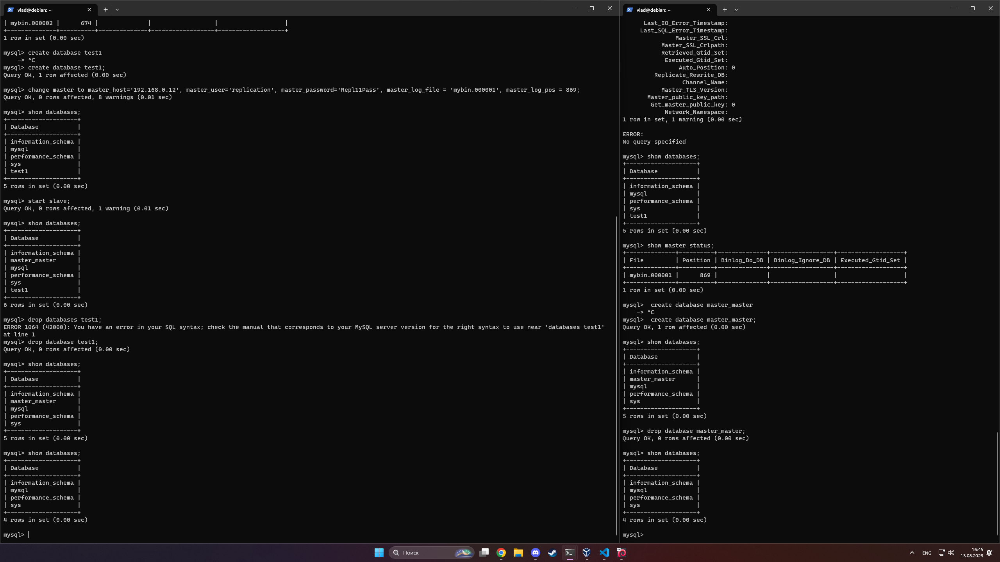
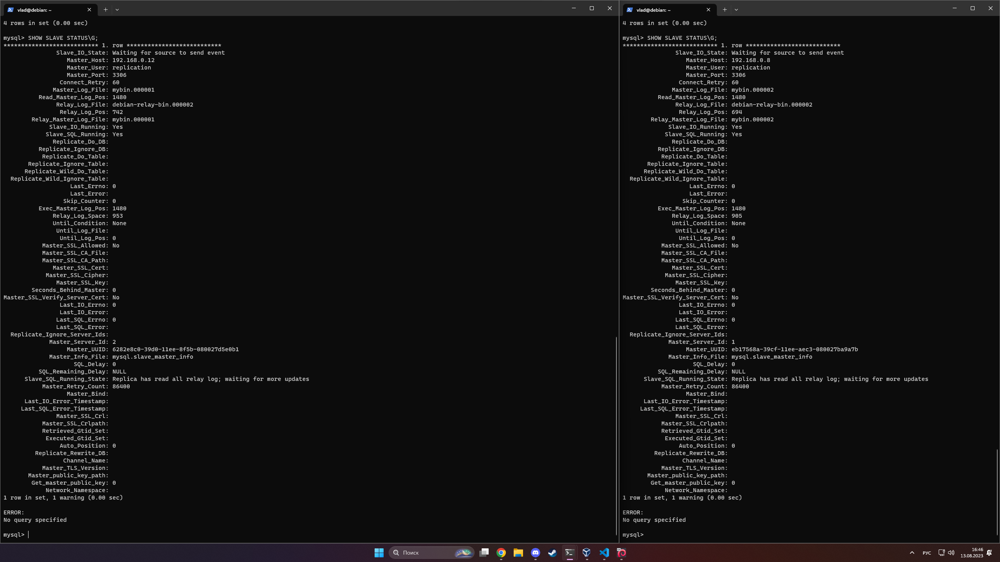

# "Replication-and-scaling.-Part-1" | "Бойко Владислав"
## Задание 1
В случае с master-slave клиент записывает/обновляет/удаляет данные на мастер сервер, а читает только со слейва.
В случае с master-master клиент может как читать так и записывать изменения на обе ноды
---
## Задание 2
Ну вроде бы вот вывод видно что одно к другому подсасалось

А вот оно создалось на слейве

---
## Задание 3
Идентичные действия только теперь для мастер ноды

Вот слейв статус

